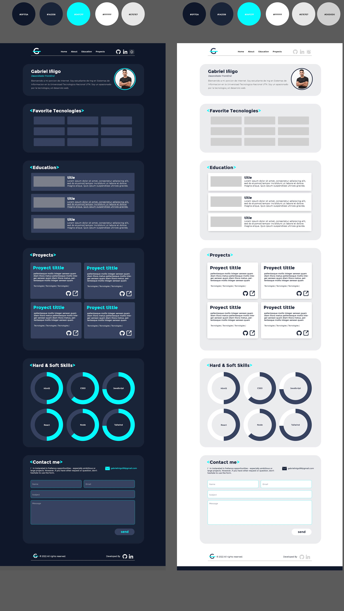

# Portfolio web | Angular | Argentina Programa | #YoProgramo

## Caracteristicas de la App

- Portfolio personal 


## ScreenShots 

<p align="center">
  
</p>


## How to use

To clone and run this application, you'll need [Git](https://git-scm.com/downloads) and [Angular](https://angular.io/). From your command line:
```
# Clone this repository
$ git clone https://github.com/ginigo-arg/hotel-recipes.git

# Go into the repository
$ 

# Install dependencies
$

# Run the app
$ 
```

## Acceso
- User: 
- Pass: 
